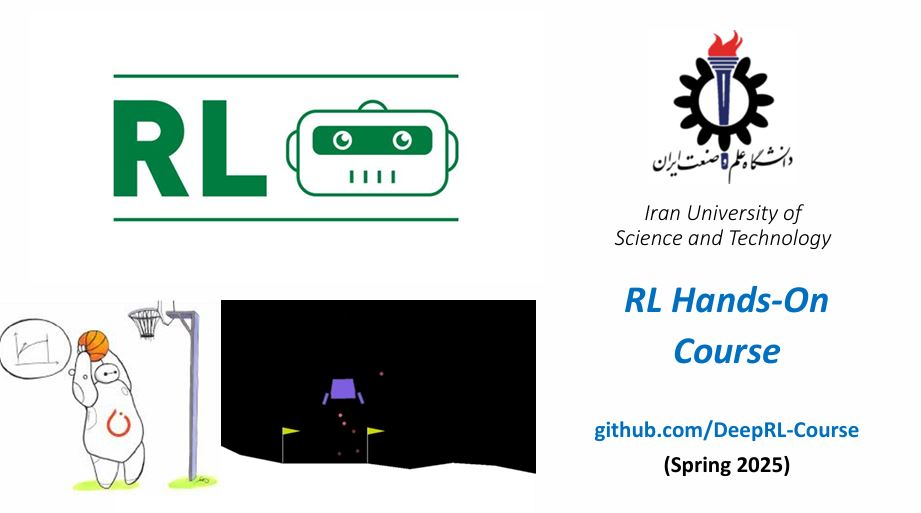

# Deep Reinforcement Learning - Google Colab Notebooks

This repository provides a collection of **Deep Reinforcement Learning (DRL)** Jupyter notebooks designed for educational use. These materials are ideal for **undergraduate and graduate-level reinforcement learning courses**, workshops, or self-study.

All notebooks are:
- ✅ Fully tested
- ☁️ Ready to use with **Google Colab**

---

## 📁 Repository Structure

### 📦 `01_gym_intro`  
**Introduction to OpenAI Gym**  
- Basic RL concepts: agent, environment, reward, action, and observation space  
- Hands-on introduction to using OpenAI Gym environments

---

### 📦 `02_Multi-Armed_Bandits`  
**Multi-Armed Bandit Algorithms**  
- Exploration vs. exploitation  
- ε-greedy strategies, Upper Confidence Bound (UCB), and other basic bandit algorithms

---

### 📦 `03_Value_Based_Methods`  
**Value-Based Methods**  
- Q-Learning and SARSA implementations  
- Estimating value functions and learning optimal policies

---

### 📦 `04_Policy_Based_Methods`  
**Policy-Based Methods**  
- REINFORCE algorithm  
- Introduction to direct policy optimization

---

### 📦 `05_DRL_DQN`  
**Deep Q-Network (DQN)**  
- Apply DQN to environments like Lunar Lander  
- Combine neural networks with Q-learning to scale to larger state spaces

---

### 📦 `06_DRL_SB3_Tutorial`  
**Hands-On with Stable Baselines3 (SB3)**  
- Use SB3 to implement RL algorithms using PyTorch  
- Examples with DQN, PPO, and A2C in OpenAI Gym environments

---

### 📦 `07_Batch_RL`  
**Offline Reinforcement Learning**  
- Learn from fixed datasets without interacting with the environment  
- Basics of batch RL workflows and challenges

---

## 🚀 Getting Started

You can run all notebooks directly in Google Colab—no setup required.

---

## 📄 License

This project is released under the [MIT License](LICENSE). Feel free to use, modify, and distribute for educational and research purposes.

---

## Credits

This notebook collection was created as part of an educational initiative on Deep Reinforcement Learning.

- **Course Provider**: [Armin Attarzadeh](https://www.linkedin.com/in/armin-att)  
- **Instructor**: Dr. Amirfarhad Farhadi
- **Affiliation**: Iran University of Science and Technology

We acknowledge the contributions of the open-source community and academic resources that supported the development of these materials.
